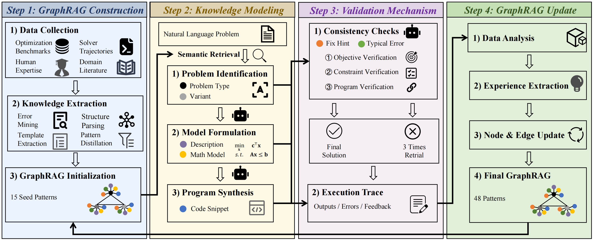

# OptGraph

The code in this toolbox implements "OptGraph: Boosting LLM-Driven Evolutionary Optimization Via Adaptive GraphRAG" by <i>X. Xiu, J. Li, H. Chen, W. Liu</i>.



## What Is Included

- `WorkFlowGraphRAG.py`: main OptGraph workflow with graph-guided retrieval, validation, repair, and result export.
- `GraphRAG/or_benchmark_graphrag_adaptive.json`: adaptive graph-structured modeling knowledge used in the main experiments.
- `GraphRAG/adaptive_update_from_traces.py`: adaptive graph update utility for extracting reusable modeling knowledge from execution traces.
- `GraphRAG/retrieve_or_benchmark_graphrag.py`: retrieval utility for expanding graph neighborhoods during inference.
- `markdown_seeds/`: seed modeling-pattern descriptions.
- `evaluate_result.py`: utility for computing exact and 5% tolerance accuracy from generated results.
- `scripts/run_main_experiment.ps1`: example script for running the main experiment.

## What Is Not Included

This public release does not include raw logs, temporary outputs, private error-analysis files, API keys, or non-main experimental scripts.

## Installation

```bash
pip install -r requirements.txt
```

The generated solver code may require an optimization solver package such as PuLP or Gurobi, depending on the generated program and your local environment.

## API Keys

Set API keys through environment variables. Do not hard-code keys in the repository.

```bash
OPENAI_API_KEY=your_openai_api_key
GEMINI_API_KEY=your_gemini_api_key
```

For OpenAI-compatible gateway services, configure the corresponding base URL variables in `.env.example`.

## Datasets

The processed CSV files for the six main benchmarks are placed under `Dataset/`:

```text
Dataset/
  NL4OPT_old.csv
  IndustryOR.csv
  OptiBench_605.csv
  MAMO_EasyLP_fixed.csv
  MAMO_ComplexLP_fixed.csv
  OptMATH_Bench.csv
```

Each CSV contains a `Query` column for the natural-language problem and a `Label` column for the ground-truth answer.

## Run Main Experiment

PowerShell example:

```powershell
.\scripts\run_main_experiment.ps1
```

Or run directly:

```bash
python WorkFlowGraphRAG.py
```

Main configurable variables include:

- `DATASET_FILENAME`: dataset file name under `Dataset/`.
- `QUERY_COLUMN`: column containing the natural-language problem.
- `MAX_SAMPLES`: maximum number of samples; use `0` for all samples.
- `START_SOURCE_ROW` and `END_SOURCE_ROW`: optional row range.
- `ENABLE_VALIDATION_AGENT`: set to `1` to enable validation and repair.

Outputs are written to `RESULT/`, which is ignored by git.

## Adaptive Graph Update

The released GraphRAG file is `GraphRAG/or_benchmark_graphrag_adaptive.json`.
To update the graph from completed execution traces, use:

```bash
python GraphRAG/adaptive_update_from_traces.py
```

The update script reads API credentials from environment variables such as `OPENAI_API_KEY`.


### Citation
Please give credits to this paper if this code is useful and helpful for your research.


